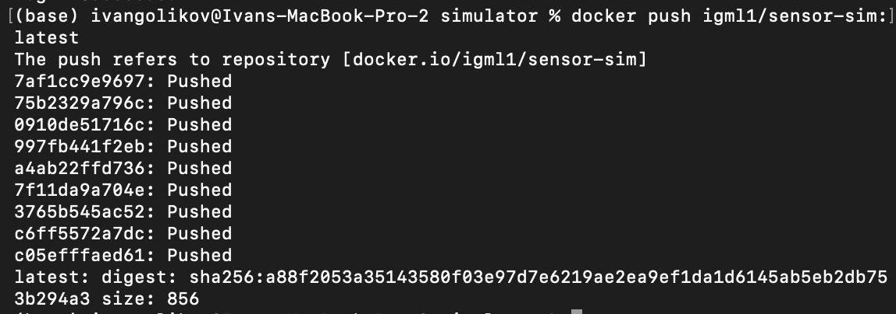
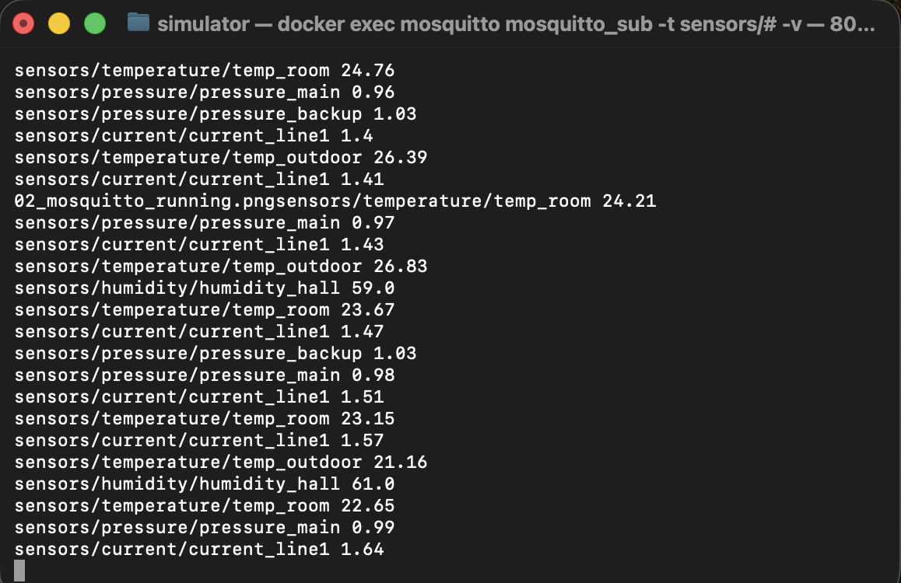
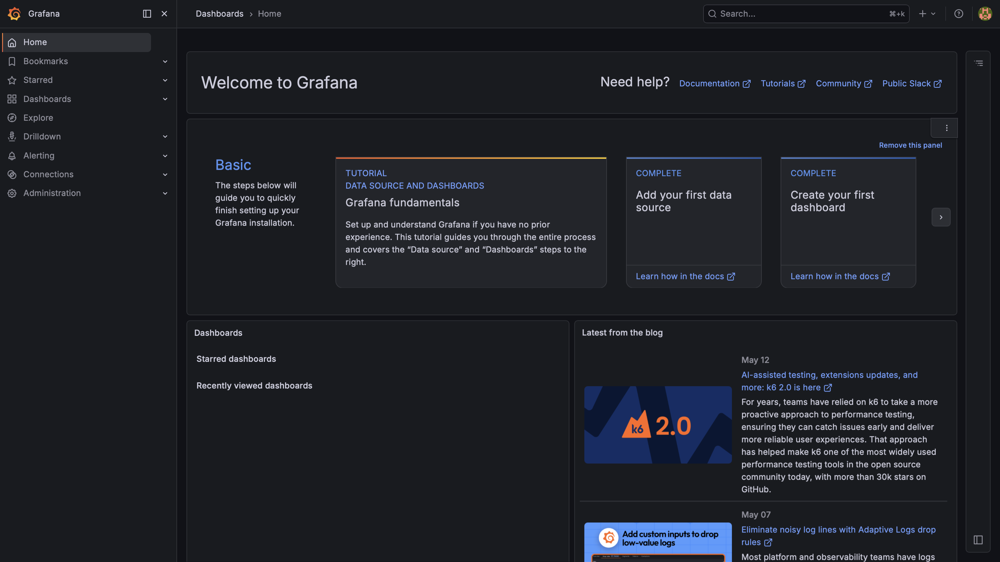
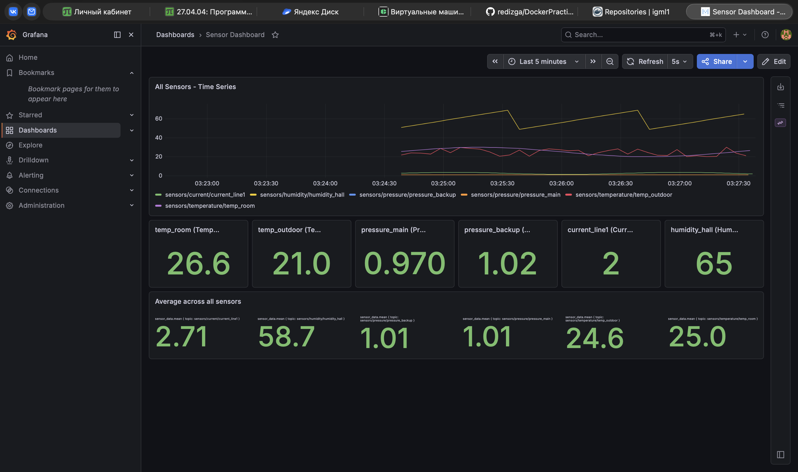
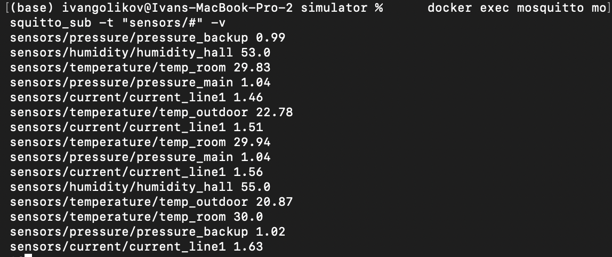
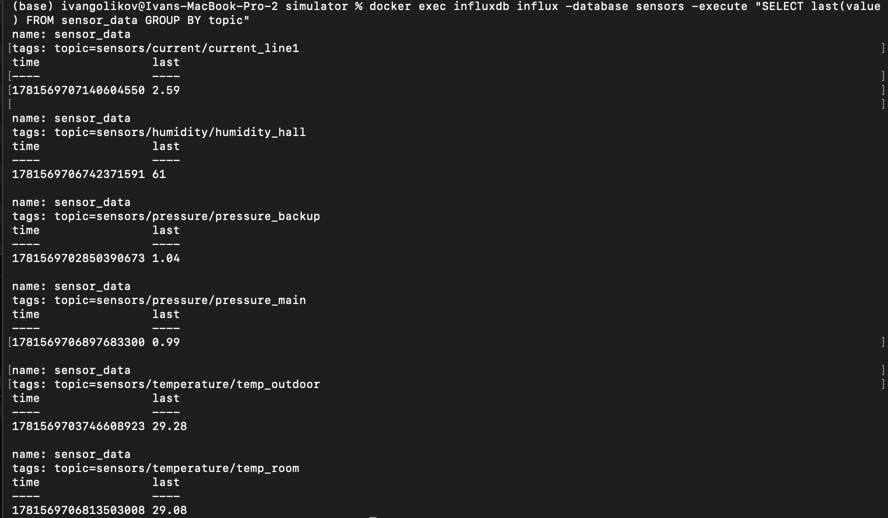

# Лабораторная работа 2 - Docker

## Введение

Задача: развернуть систему сбора данных с датчиков через MQTT-брокер с визуализацией в Grafana. Все сервисы запускаются в Docker-контейнерах на трёх виртуальных машинах из лабораторной 1.

Среда выполнения: Mac M1, Docker Desktop. Три "машины" эмулируются через отдельные docker-compose файлы, объединённые общей сетью `lab2_net`.

---

## Архитектура системы

```
Linux A (client)              Linux B (gateway)           Linux C (server)
6 sensor containers  -->  mosquitto:1883  -->  telegraf --> influxdb:8086
igml1/sensor-sim                                        --> grafana:3000
```

| Машина | Сервисы | Порты |
|--------|---------|-------|
| Linux A | 6 sensor-sim контейнеров | - |
| Linux B | eclipse-mosquitto | 1883 |
| Linux C | influxdb:1.8, telegraf, grafana | 8086, 3000 |

---

## Linux A - Симуляторы датчиков

### Класс Sensor и наследники

Файл `vms/client/simulator/sensor.py`.

Базовый класс `Sensor` - абстрактный, определяет метод `read()` и логику формулы генерации значения. Формула выбирается через ENV-переменную `FORMULA_TYPE`:

- `random` - случайный шум в диапазоне амплитуды
- `sin` - синусоидальный сигнал: `sin(step * 11 / 100) * amplitude` (11 - день рождения)
- `linear` - пилообразный сигнал с периодом 11

Четыре типа датчиков:

| Класс | Тип | Базовое значение | Амплитуда |
|-------|-----|-----------------|-----------|
| TemperatureSensor | temperature | 25.0 °C | 5.0 |
| PressureSensor | pressure | 1.013 бар | 0.05 |
| CurrentSensor | current | 2.5 А | 1.1 (= 11/10) |
| HumiditySensor | humidity | 60.0 % | 11.0 |

Амплитуды датчиков тока и влажности используют число 11 (день рождения 11.11) как операнд формулы.

### Конфигурация через переменные среды

| Переменная | Назначение | По умолчанию |
|-----------|-----------|--------------|
| `SENSOR_TYPE` | Тип датчика (temperature/pressure/current/humidity) | temperature |
| `SENSOR_NAME` | Имя датчика | sensor1 |
| `MQTT_BROKER` | Хост брокера | mosquitto |
| `MQTT_PORT` | Порт брокера | 1883 |
| `INTERVAL` | Интервал публикации, сек | 5 |
| `FORMULA_TYPE` | Тип формулы (random/sin/linear) | random |
| `TOPIC_FORMAT` | Формат топика (value/json) | value |

### Топики MQTT

При `TOPIC_FORMAT=value` (по умолчанию):
- топик: `sensors/<type>/<name>`
- payload: `22.4` (plain float)

При `TOPIC_FORMAT=json`:
- топик: `sensors/<type>`
- payload: `{"name": "sensor1", "value": 22.4}`

### Шесть контейнеров

| Контейнер | Тип | Имя | Интервал | Формула |
|-----------|-----|-----|----------|---------|
| sensor_temp_1 | temperature | temp_room | 3 сек | sin |
| sensor_temp_2 | temperature | temp_outdoor | 5 сек | random |
| sensor_pressure_1 | pressure | pressure_main | 4 сек | linear |
| sensor_pressure_2 | pressure | pressure_backup | 7 сек | random |
| sensor_current_1 | current | current_line1 | 2 сек | sin |
| sensor_humidity_1 | humidity | humidity_hall | 6 сек | linear |

### Docker Hub

Образ опубликован в публичный репозиторий: `igml1/sensor-sim:latest`

```bash
docker build -t igml1/sensor-sim:latest ./vms/client/simulator
docker push igml1/sensor-sim:latest
```



---

## Linux B - Mosquitto брокер

### Конфигурация (`vms/gateway/mosquitto/mosquitto.conf`)

```
listener 1883
allow_anonymous true
persistence true
persistence_location /mosquitto/data/
log_dest stdout
```

Брокер принимает анонимные подключения, слушает порт 1883, сохраняет данные между перезапусками.

### Запуск

Через docker-compose (`vms/gateway/docker-compose.yml`):

```bash
docker compose -f vms/gateway/docker-compose.yml up -d
```

Или через скрипт (`vms/gateway/mosquitto/start.sh`):

```bash
docker run \
  -v "$(pwd)/mosquitto:/mosquitto/config" \
  -p 1883:1883 \
  --name mosquitto \
  --network lab2_net \
  --rm \
  eclipse-mosquitto
```



---

## Linux C - InfluxDB + Telegraf + Grafana

### InfluxDB 1.8

База данных `sensors`, пользователь `telegraf`/`telegraf`. Инициализируется через переменные среды при первом запуске:

```yaml
environment:
  - INFLUXDB_DB=sensors
  - INFLUXDB_USER=telegraf
  - INFLUXDB_USER_PASSWORD=telegraf
  - INFLUXDB_ADMIN_USER=admin
  - INFLUXDB_ADMIN_PASSWORD=admin
```

### Telegraf (`vms/server/telegraf/telegraf.conf`)

Подписка на все топики брокера, запись в InfluxDB. Ссылки на сервисы - по alias контейнеров, не по IP:

```toml
[[inputs.mqtt_consumer]]
  servers = ["tcp://mosquitto:1883"]
  topics = ["sensors/#"]
  data_format = "value"
  data_type = "float"
  name_override = "sensor_data"

[[outputs.influxdb]]
  urls = ["http://influxdb:8086"]
  database = "sensors"
  username = "telegraf"
  password = "telegraf"
  skip_database_creation = true
```

Каждое сообщение сохраняется как measurement `sensor_data` с тегом `topic` = полный путь топика.

### Grafana

Порт 3000, логин `admin`/`admin`.

Datasource и dashboard подгружаются автоматически через provisioning (`vms/server/grafana/provisioning/`).

Dashboard содержит:
- Time series со всеми 6 датчиками на одном графике (GROUP BY topic)
- 6 stat-панелей с текущим значением каждого датчика
- Общую stat-панель со средним значением по всем датчикам





### Volumes

Данные InfluxDB и конфигурация Grafana сохраняются в именованных томах - при пересоздании контейнеров данные и дашборды не теряются:

```yaml
volumes:
  influx_data:/var/lib/influxdb
  grafana_data:/var/lib/grafana
```

---

## Проверка работы

### Мониторинг потока данных

```bash
# Смотреть сообщения в брокере
docker exec mosquitto mosquitto_sub -t "sensors/#" -v

# Последние значения в InfluxDB
docker exec influxdb influx -database sensors -execute "SELECT last(value) FROM sensor_data GROUP BY topic"
```





---

## Инструкция по запуску

```bash
# 1. Создать сеть
docker network create lab2_net

# 2. Запустить брокер (Linux B)
docker compose -f vms/gateway/docker-compose.yml up -d

# 3. Запустить сервер (Linux C)
docker compose -f vms/server/docker-compose.yml up -d

# 4. Запустить датчики (Linux A) - образ скачается с Docker Hub
docker compose -f vms/client/docker-compose.yml up -d

# 5. Открыть Grafana: http://localhost:3000 (admin/admin)
```

---

## Структура репозитория

```
lab2/
  assets/images/          - скриншоты для отчёта
  vms/
    client/
      simulator/          - код симулятора (sensor.py, main.py, Dockerfile)
      docker-compose.yml  - 6 контейнеров датчиков
    gateway/
      mosquitto/
        mosquitto.conf    - конфиг брокера
        start.sh          - скрипт запуска без compose
      docker-compose.yml
    server/
      telegraf/
        telegraf.conf     - подписка на MQTT, запись в InfluxDB
      grafana/
        provisioning/     - автоматическая загрузка datasource и dashboard
      docker-compose.yml  - influxdb + telegraf + grafana
  report.md
```
